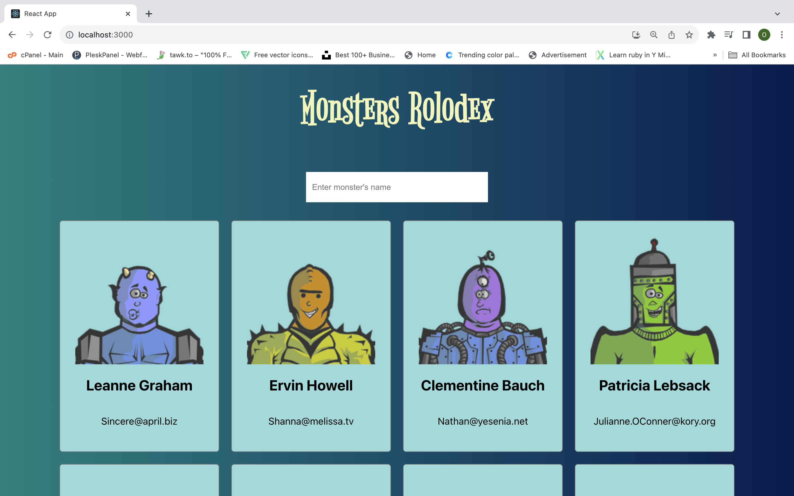
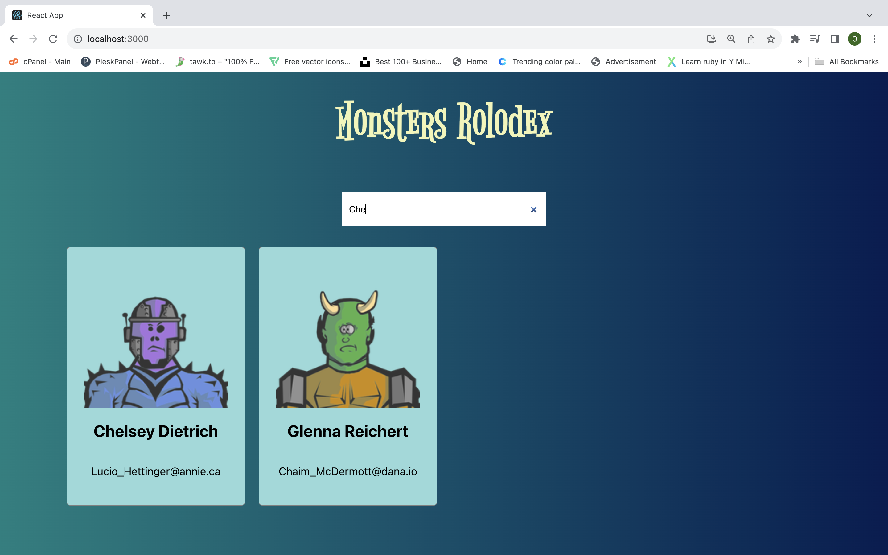
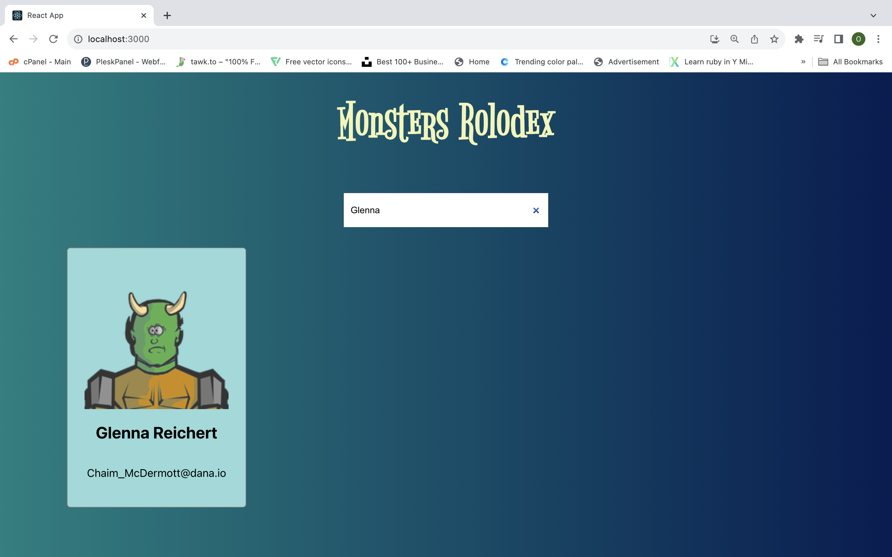

# MONSTER ROLODEX 2
Monster Rolodex 2 is a single page application (SPA) as a practice project for a REACT JS course, built using the modern tools and techniques such as ReactJS. The data is being fetch from a third party API and the client application communicates with an API server over HTTP, using the JSON format.

## APP FEATURES
1. Load a list of Monsters with its specific details such as name, image and email address.
2. A user can search a specific monster by entering it's name in the search field.
3. The application makes API requests to load data.

## TECHNICAL SPECIFICATIONS
The project uses ReactJS, API, HTML, CSS, Javascript. The version 2 of this project was written in functional component to learn and understand how it differs from class components.

## Setup
Install dependencies with `npm install`.

## Running Webpack Development Server
npm start

## Final Product

